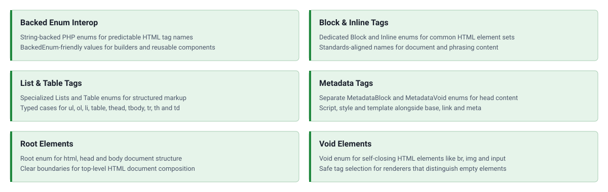

<!-- markdownlint-disable MD041 -->
<p align="center">
    <a href="https://github.com/ui-awesome/html-interop" target="_blank">
        
    </a>
    <h1 align="center">Html Interop</h1>
    <br>
</p>
<!-- markdownlint-enable MD041 -->

<p align="center">
    <a href="https://github.com/ui-awesome/html-interop/actions/workflows/build.yml" target="_blank">
        
    </a>
    <a href="https://github.com/ui-awesome/html-interop/actions/workflows/static.yml" target="_blank">
        
    </a>
    <a href="https://github.com/ui-awesome/html-interop/actions/workflows/security.yml" target="_blank">
        
    </a>
</p>

<p align="center">
    <strong>Type-safe string-backed enums for HTML tag interoperability</strong><br>
    <em>Provides standardized tag collections for block, inline, list, root, table, metadata, and void elements.</em>
</p>

## Features

<picture>
    <source media="(max-width: 767px)" srcset="./docs/svgs/features-mobile.svg">
    
</picture>

### Installation

```bash
composer require ui-awesome/html-interop:^0.4
```

### Quick start

#### Using block-level HTML tags

Access standardized block-level tag names through the `Block` enum.

```php
<?php

declare(strict_types=1);

namespace App;

use UIAwesome\Html\Interop\Block;

echo Block::DIV->value;
// 'div'

echo Block::ARTICLE->value;
// 'article'

echo Block::SECTION->value;
// 'section'
```

#### Using inline-level HTML tags

Access standardized inline-level tag names through the `Inline` enum.

```php
<?php

declare(strict_types=1);

namespace App;

use UIAwesome\Html\Interop\Inline;

echo Inline::SPAN->value;
// 'span'

echo Inline::STRONG->value;
// 'strong'

echo Inline::A->value;
// 'a'
```

#### Using void (self-closing) HTML tags

Access standardized void element tag names through the `Voids` enum.

```php
<?php

declare(strict_types=1);

namespace App;

use UIAwesome\Html\Interop\Voids;

echo Voids::IMG->value;
// 'img'

echo Voids::INPUT->value;
// 'input'

echo Voids::BR->value;
// 'br'
```

#### Using specialized HTML tag collections

Use specialized enums for list, root, and table elements.

```php
<?php

declare(strict_types=1);

namespace App;

use UIAwesome\Html\Interop\{Lists, Root, Table};

// List elements
echo Lists::UL->value;
// 'ul'

echo Lists::OL->value;
// 'ol'

echo Lists::LI->value;
// 'li'

// Root elements
echo Root::HTML->value;
// 'html'

echo Root::HEAD->value;
// 'head'

echo Root::BODY->value;
// 'body'

// Table elements
echo Table::TABLE->value;
// 'table'

echo Table::THEAD->value;
// 'thead'

echo Table::TR->value;
// 'tr'

echo Table::TD->value;
// 'td'
```

#### Type safety with BackedEnum

Use `BackedEnum` to accept any string-backed enum in your rendering implementations.

```php
<?php

declare(strict_types=1);

namespace App;

use BackedEnum;
use UIAwesome\Html\Interop\Block;

/**
 * Render HTML using any string-backed enum.
 */
function renderBlock(BackedEnum $tag, string $content): string
{
    return sprintf('<%s>%s</%s>', $tag->value, $content, $tag->value);
}

echo renderBlock(Block::DIV, 'Content');
// <div>Content</div>

echo renderBlock(Block::ARTICLE, 'Article content');
// <article>Article content</article>
```

#### Filtering and iterating tags

Leverage PHP 8.1+ enum features for filtering and tag operations.

```php
<?php

declare(strict_types=1);

namespace App;

use UIAwesome\Html\Interop\Block;

// Filter heading elements
$headings = array_filter(
    Block::cases(),
    fn (Block $tag) => str_starts_with($tag->name, 'H'),
);

foreach ($headings as $heading) {
    echo $heading->value . PHP_EOL;
}
// h1
// h2
// h3
// h4
// h5
// h6

// Get all block tag names
$tagNames = array_map(fn (Block $tag) => $tag->value, Block::cases());
```

#### Contracts package (optional)

If you need contract-based typing, install `ui-awesome/html-contracts` and use its element interfaces.

- `UIAwesome\Html\Contracts\Element\BlockInterface`
- `UIAwesome\Html\Contracts\Element\InlineInterface`
- `UIAwesome\Html\Contracts\Element\VoidInterface`

```bash
composer require ui-awesome/html-contracts:^0.1
```

## Documentation

For detailed configuration options and advanced usage.

- 🧪 [Testing Guide](docs/testing.md)

## Package information

[](https://www.php.net/releases/8.3/en.php)
[](https://packagist.org/packages/ui-awesome/html-interop)
[](https://packagist.org/packages/ui-awesome/html-interop)

## Project status

[](https://github.com/ui-awesome/html-interop/actions/workflows/static.yml)
[](https://github.com/ui-awesome/html-interop/actions/workflows/quality.yml)
[](https://github.styleci.io/repos/767397797?branch=main)

## Our social networks

[](https://x.com/Terabytesoftw)
[](https://www.facebook.com/wilmer.arambula.9)

## License

[](LICENSE)
